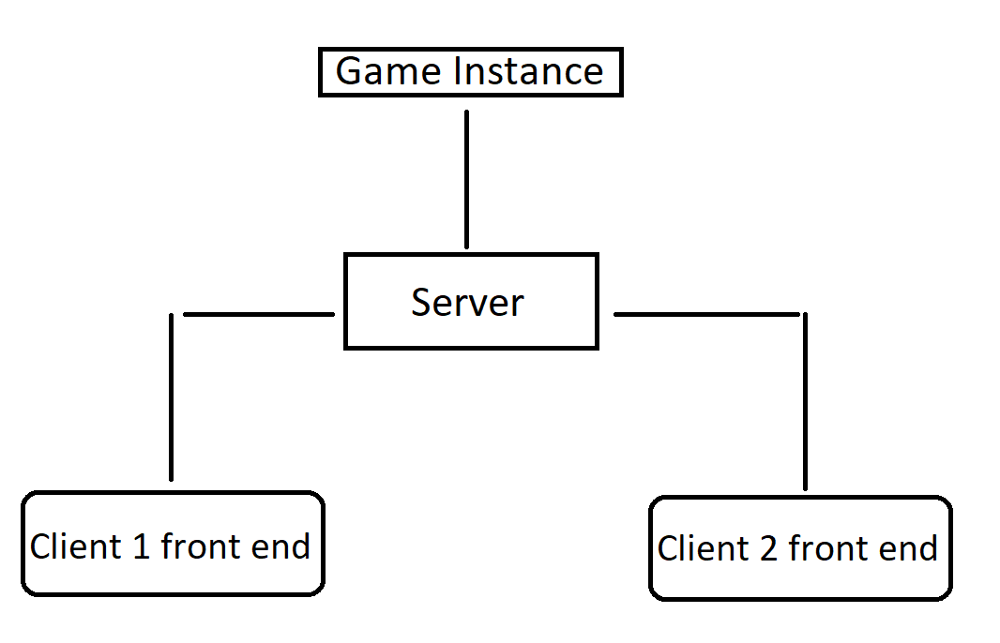

# Tic4Server
#### A basic game server that allows people to play Tic-Tac-Toe and Connect 4

# Component  Descriptions
### Server
- Locates another player for the client
- Connects both players
- Handles the communication between the game instance and the players
- Creates a Game Instance
- Closes Game Instance

### Game Instance
- Handles all the game logic
- Uses Server to manage connection between players
- Transmits game state to players through the Server
- Handles AI player
- Handles player to player chat

### Client Front End
- Communicates with Server to get requests fullfilled
- Sends Action to Game Instance using Server
- Renders game and chat box

## Roadmap
- **Implement Game Logic for Tic-Tac-Toe and Connect 4**:
  - Define game rules and win conditions.
  - Handle player moves and game state management.

- **Create Core Pages for the User Interface**:
  - **Home Page**: Landing page with game options and information.
  - **Quick Play**: Enables players to quickly join a game.
  - **Lobby**: Allows players to create, join, and wait in game rooms.
  - **Game Page**: The main interface for playing Tic-Tac-Toe and Connect 4.

- **Establish Server-Player Communication**:
  - Set up initial connections using WebSockets for gameplay.
  - Handle connection timeouts

  ---

### Software Stack
#### Backend: Python
#### Frontend: Javascript(React)